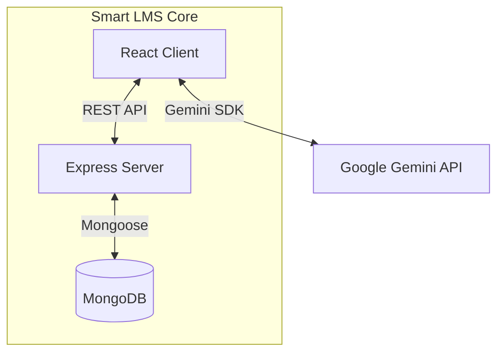

# 🎓 Smart LMS: AI-Enhanced Adaptive Learning System


> **Experience education, evolved.**
> Smart LMS transforms traditional e-learning into a truly *personalized* experience using Generative AI. It adapts lessons to each learner’s style, pace, and cognitive preferences.

---

## 📖 Table of Contents

* [Overview](#-overview)
* [Key Features](#-key-features)
* [The AI Engine](#-the-ai-engine)
* [Tech Stack](#-tech-stack)
* [System Architecture](#-system-architecture)
* [Getting Started](#-getting-started)
* [Screenshots](#-screenshots)
* [Project Structure](#-project-structure)
* [Contributors](#-contributors)
* [License](#-license)

---

## 🔭 Overview

Traditional Learning Management Systems often follow a rigid “one-size-fits-all” structure. **Smart LMS** reimagines this paradigm by integrating *Generative AI* to create a personalized learning loop.

Built with the **MERN Stack** and powered by **Google Gemini**, Smart LMS identifies user learning preferences (Visual, Auditory, Kinesthetic, etc.) and dynamically transforms static lesson content into tailored explanations, simplified summaries, stories, or technical breakdowns — based on the learner’s needs.

---

## 🚀 Key Features

### 🧠 For Students

* **Adaptive Content:** Rewrite lessons instantly using modes like *Story*, *Technical*, *Beginner*, etc.
* **Intelligent Assessment:** AI-generated quizzes with detailed explanations for incorrect answers.
* **Immersive Reader:** Text-to-Speech with customizable AI voice profiles.
* **Secure Chat:** Instructor–student live messaging.

### 👨‍🏫 For Instructors

* **Course Builder:** Create lessons with text, video, images, and assessments.
* **AI-Generated Outlines:** Create complete modules using only a topic title.
* **Engagement Analytics:** Track student progress and performance visually.

### 🛡️ For Administrators

* **System Health Dashboard:** AI-generated operational insights.
* **RBAC:** Manage access levels and roles.
* **Visual Reports:** Enrollment, performance, and usage charts.

---

## 🤖 The AI Engine

Smart LMS uses a dedicated `GeminiService` acting as an AI middleware between the UI and database.

**Pipeline:**

1. **Profiling:** Capture user preferences → learning style, tone, difficulty.
2. **Intercept:** Fetch core lesson text when the user opens content.
3. **Transform:** Run the content through prompt-chains using Gemini Pro.
4. **Render:** Provide hallucination-checked, personalized content in the UI.

---

## 💻 Tech Stack
| **Layer**     | **Technology**    | **Description**                    |
| ------------- | ----------------- | ---------------------------------- |
| **Frontend**  | React + Vite      | Fast, modular UI development       |
| **Styling**   | Tailwind CSS      | Utility-first, responsive design   |
| **Backend**   | Node.js + Express | RESTful API & server logic         |
| **Database**  | MongoDB           | NoSQL document storage             |
| **AI Engine** | Google Gemini Pro | Generative AI for adaptive content |
| **Charts**    | Recharts          | Analytics & interactive dashboards |

---

## 🏗 System Architecture



---

## ⚡ Getting Started

### ✅ Prerequisites

* Node.js v16+
* MongoDB (local or Atlas)
* Google Gemini API Key

---

### 📥 Installation

#### 1. Clone the repository

```bash
git clone https://github.com/yourusername/smart-lms.git
cd smart-lms
```

#### 2. Install Dependencies

```bash
# Root dependencies (frontend or monorepo)
npm install

# Backend
cd server
npm install
cd ..
```

#### 3. Environment Variables

Create a `.env` file:

```env
API_KEY=your_google_gemini_api_key_here
MONGO_URI=your_mongodb_connection_string
PORT=5000
```

#### 4. Start the Backend

```bash
node server/server.js
```

*Runs on port **5000***.

#### 5. Start the Frontend

```bash
npm run dev
```

*Runs on port **5173***.

#### 6. (Optional) Auto Seed

If your database is empty, the system seeds initial roles and sample data.

---

## 📸 Screenshots

| Landing Page                                                      | Student Dashboard                                                        |
| ----------------------------------------------------------------- | ------------------------------------------------------------------------ |
|  |  |

| Adaptive Learning                                                      | AI Analytics                                                           |
| ---------------------------------------------------------------------- | ---------------------------------------------------------------------- |
| ) |  |

---

## 📂 Project Structure

```
Smart_LMS/
├── components/          # Reusable UI Components
├── services/            # API & AI Service Layers
├── server/              # Backend Models, Controllers, Routes
├── documents/           # Project Report, UML, Designs
├── App.tsx              # Application Router & State
└── index.html           # App Entry
```

---

## 👥 Contributors
1. Godfrey T R — Lead Developer
2. Girijesh R — AI Integration Engineer
3. Grish Narayanan S — Backend Developer
4. Harihar R — Frontend Developer

---

## 📄 License

This project is licensed under the **MIT License**.
