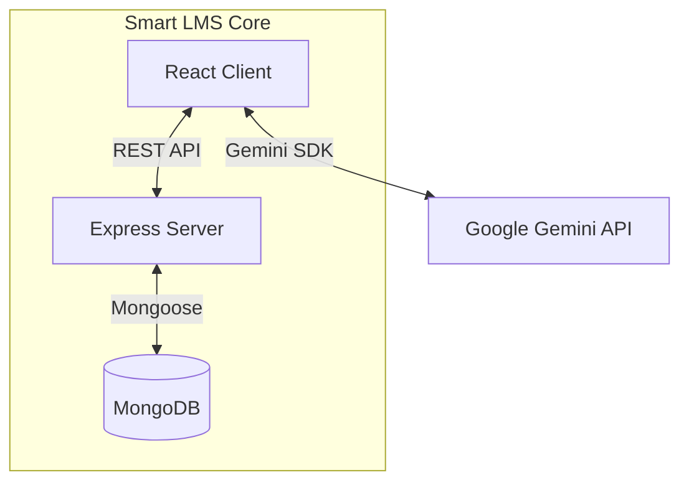

# 🎓 Smart LMS: AI-Enhanced Adaptive Learning System


> **Experience education, evolved.**
> Smart LMS transforms traditional e-learning into a truly *personalized* experience using Generative AI. It acts as an intelligent tutor, adapting lessons to each learner’s style, pace, and cognitive preferences in real-time.

---

## 📖 Table of Contents

* [Overview](#-overview)
* [Key Features](#-key-features)
* [The AI Engine](#-the-ai-engine)
* [Tech Stack](#-tech-stack)
* [System Architecture](#-system-architecture)
* [Getting Started](#-getting-started)
* [Demo Credentials](#-demo-credentials)
* [Screenshots](#-screenshots)
* [Contributors](#-contributors)
* [License](#-license)

---

## 🔭 Overview

Traditional Learning Management Systems often follow a rigid “one-size-fits-all” structure. **Smart LMS** reimagines this paradigm by integrating **Google Gemini 2.5 Flash** to create a personalized learning loop.

Identifying user learning preferences (Visual, Auditory, Kinesthetic, etc.) via a psychometric profile, the system dynamically intercepts static lesson content and transforms it into tailored explanations, simplified summaries, stories, or technical breakdowns.

---

## 🚀 Key Features

### 🧠 For Students

* **Adaptive Content Engine:** Rewrites lesson text instantly using modes like *Story*, *Technical*, *Beginner*, or *Analogy-based*.
* **Immersive Reader (TTS):** High-fidelity Text-to-Speech powered by Gemini Audio, with selectable personas (Friendly, Formal, etc.) and variable playback speed.
* **Intelligent Assessment:** AI-generated quizzes based strictly on lesson content, providing detailed, corrective feedback for every answer.
* **Ask Instructor:** Send context-aware queries about specific lessons, with support for file attachments.
* **Smart Certificates:** Auto-generated, printable certificates upon course completion.

### 👨‍🏫 For Instructors

* **AI Course Builder:** Generate complete course outlines and lesson drafts from a single topic title.
* **Real-time Chat:** A modern side-panel messaging interface to mentor students without losing context.
* **Engagement Analytics:** Granular tracking of student progress, time spent, and quiz performance.

### 🛡️ For Administrators

* **AI System Report:** Generate executive summaries of system health and user demographics using GenAI.
* **Visual Analytics:** Interactive charts (Recharts) for role distribution, learning styles, and course popularity.
* **RBAC & Security:** Role-Based Access Control and secure session management.

---

## 🤖 The AI Engine

Smart LMS uses a dedicated `GeminiService` acting as an intelligent middleware.

**Pipeline:**

1. **Profiling:** Capture user preferences → ` { style: "Visual", tone: "Friendly", level: "Beginner" }`.
2. **Intercept:** Fetch core lesson text when the user opens content.
3. **Prompt Engineering:** Construct a Chain-of-Thought prompt using `gemini-2.5-flash` with strict JSON schemas.
4. **Render:** Deliver hallucination-checked, personalized content or audio streams (`gemini-2.5-flash-preview-tts`) to the UI.

---

## 💻 Tech Stack

| **Layer**     | **Technology**    | **Description**                    |
| ------------- | ----------------- | ---------------------------------- |
| **Frontend**  | React 19 + Vite   | Fast, modular UI development       |
| **Styling**   | Tailwind CSS      | Utility-first, responsive design   |
| **Backend**   | Node.js + Express | RESTful API & server logic         |
| **Database**  | MongoDB + Mongoose| NoSQL document storage             |
| **AI Model**  | Google Gemini 2.5 | Text generation & TTS              |
| **Viz**       | Recharts          | Analytics & interactive dashboards |

---

## 🏗 System Architecture



---

## ⚡ Getting Started

### ✅ Prerequisites

* Node.js v18+
* MongoDB (local or Atlas)
* Google Gemini API Key

### 📥 Installation

#### 1. Clone the repository

```bash
git clone https://github.com/yourusername/smart-lms.git
cd smart-lms
```

#### 2. Install Dependencies

```bash
# Root dependencies (frontend)
npm install

# Backend dependencies
cd server
npm install
cd ..
```

#### 3. Environment Variables

Create a `.env` file in the root directory:

```env
API_KEY=your_google_gemini_api_key_here
```

#### 4. Start the Application

**Backend (Terminal 1):**
```bash
node server/server.js
```
*Runs on port **5000**.*

**Frontend (Terminal 2):**
```bash
npm run dev
```
*Runs on port **5173**.*

#### 5. Database Seeding
On first run, the system will automatically detect an empty database and seed it with 150+ users (Avengers-themed Instructors) and sample courses.

---

## 🔐 Demo Credentials

The system comes pre-seeded with users for testing. 

**Default Password for ALL users:** `password`

### 🔑 Key Accounts

| Role | Username | Name |
| :--- | :--- | :--- |
| **Admin** | `DB` | Divya Bharathi |
| **Instructor** | `tony.stark` | Tony Stark |
| **Instructor** | `natasha.romanoff` | Natasha Romanoff |
| **Student** | `aaron.michael.raj` | Aaron Michael Raj |

> 📂 **Full List:** See `documents/credentials.txt` for the complete list of 150+ users.

### 📝 Access Notes
1. **Password:** All seeded users have the password set to `password`.
2. **Registration:** You can register new Student accounts via the "Register Now" link on the Login screen.
3. **Role Management:** New Admin or Instructor accounts must be created by an existing Admin via the **Admin Dashboard**.

---

## 📸 Screenshots

| Landing Page                                                      | Student Dashboard                                                        |
| ----------------------------------------------------------------- | ------------------------------------------------------------------------ |
|  |  |

| Adaptive Learning                                                      | AI Analytics                                                           |
| ---------------------------------------------------------------------- | ---------------------------------------------------------------------- |
| ) |  |

---

## 🖼 Contributor Avatars
<p align="left"> 
<a href="https://github.com/HARIHAR1406" target="_blank">  </a> 
<a href="https://github.com/GRISH-SWIZZ" target="_blank">  </a> 
<a href="https://github.com/OrionGD" target="_blank">  </a> 
<a href="https://github.com/girijesh" target="_blank">  </a> 
</p>

## 👥 Contributors

| **Name**          | **Role**                | **LinkedIn Profile** |
| ----------------- | ----------------------- | -------------------- |
| Godfrey T R       | Lead Developer          | [LinkedIn](https://www.linkedin.com/in/godfrey-1823lw)        |
| Girijesh R        | AI Integration Engineer | [LinkedIn](linkedin.com/in/girijesh-r-aa3592326)        |
| Grish Narayanan S | Backend Developer       | [LinkedIn](https://www.linkedin.com/in/grish-narayanan)        |
| Harihar R         | Frontend Developer      | [LinkedIn](https://www.linkedin.com/in/harihar-r-1401hh)        |

---

## 📄 License

This project is licensed under the **MIT License**.
